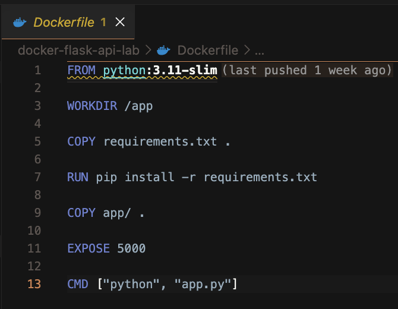
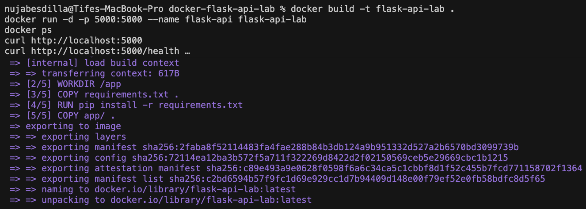
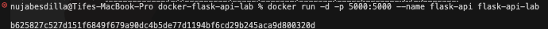
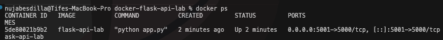
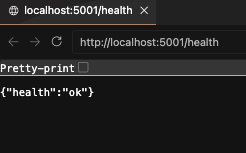
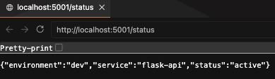
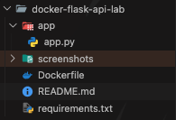

# Dockerized Flask API Lab

## Overview

This lab demonstrates a containerized Python Flask API deployed with Docker. The repository includes a simple REST API, health and status endpoints, and a screenshot-driven report showing build, deployment, and validation steps.

---

## Project Snapshot

- Flask web API running inside a Docker container
- Exposed endpoints at `http://localhost:5001`
- Verifies application health and operational status
- Captures the Docker workflow from build to endpoint validation

---

## Technologies

- Python 3.11
- Flask
- Docker
- Linux / macOS terminal
- Visual Studio Code

---

## Repository Structure

```text
docker-flask-api-lab/
├── app/
│   └── app.py
├── screenshots/
│   ├── dockerfile.png
│   ├── docker-run.png
│   ├── docker-build.png
│   ├── docker-ps.png
│   ├── health-endpoint.png
│   ├── status-endpoint.png
│   └── project-structure.png
├── Dockerfile
├── requirements.txt
└── README.md
```

---

## API Endpoints

- Home: `curl http://localhost:5001`
- Health: `curl http://localhost:5001/health`
- Status: `curl http://localhost:5001/status`

---

## Commands Executed

```bash
docker build -t flask-api-lab .
docker run -d -p 5001:5000 --name flask-api flask-api-lab
docker ps

curl http://localhost:5001
curl http://localhost:5001/health
curl http://localhost:5001/status
```

---

## Screenshot Report

<div align="center">

#### Dockerfile Configuration



#### Docker Build Output



#### Docker Container Run



#### Docker Container Status



#### Health Endpoint Validation



#### Status Endpoint Validation



#### Project Structure Overview



</div>

---

## Outcomes

- Successfully containerized a Flask API using Docker
- Validated application startup and endpoint responses
- Confirmed health and status endpoints through direct HTTP requests
- Produced a screenshot-based workflow report for easy review

---

## Skills Demonstrated

- Docker container build and deployment
- Flask REST API development
- HTTP endpoint validation
- Linux/macOS terminal operations
- Project documentation and reporting
